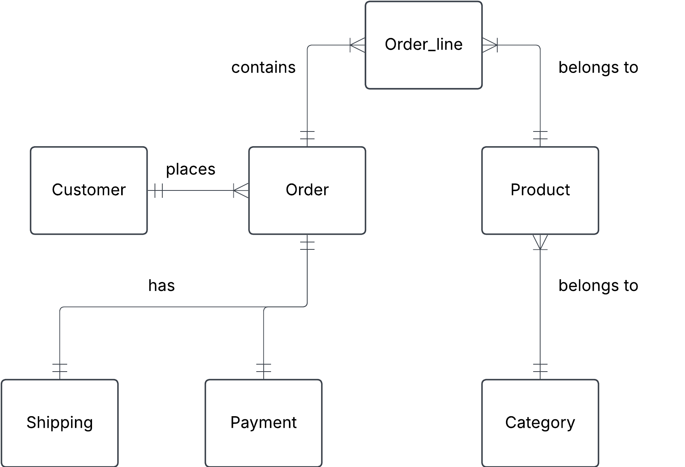

# Online store
You are designing a database for an online store that sells multiple products. Customers can place multiple orders, and each order contains multiple products.

# a) Identify entities and their relationships

## Entities

Customer

Order

Product

Category

Payment

Shipping

Order_item

## Relationships

***Customer*** places ***Order***

***Order*** contains ***Product***

***Product*** belongs to ***Category***

***Order*** has ***Payment***

***Order*** has ***Shipping***

# b) Create a conceptual ERD with cardinalities

