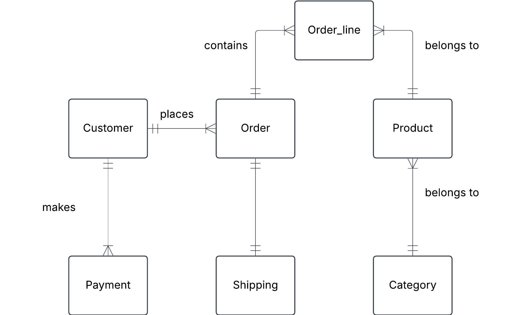

# Online store
You are designing a database for an online store that sells multiple products. Customers can place multiple orders, and each order contains multiple products.

# a) Identify entities and their relationships

## Entities

Customer

Order

Product

Category

Payment

Shipping

Order_item

## Relationships

***Customer*** can place one or more ***Orders***

***Order*** contains one or more ***Products***, but one ***Product*** can be in one or more ***Orders***

Therefore we need ***Order_Line*** as composite entity

***Product*** belongs to one and only ***Category***

***Category*** can have one or more products

***Order*** has one and only ***Payment***

***Order*** has one and only ***Shipping***

# b) Create a conceptual ERD with cardinalities

---

# Business rules

- Category must have at least one product
- One product can only belong to one category
- Everything is shipped from the same warehouse
