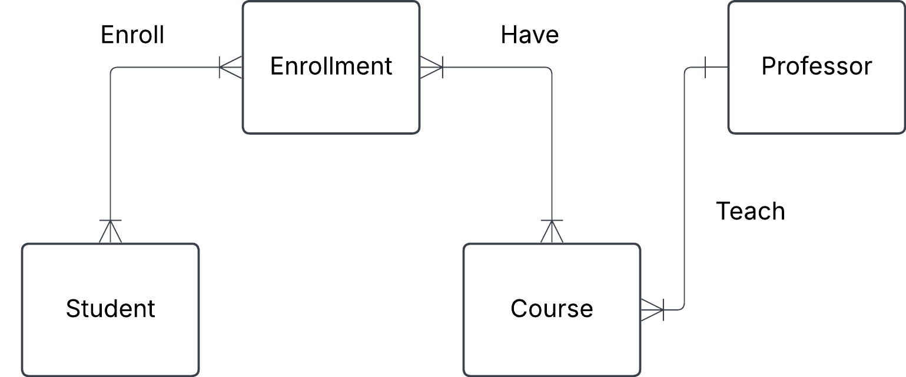

# University management system

A university needs a system to manage students, courses, and professors.

Each student can enroll in multiple courses.

Each course is taught by one professor.

A teacher can teach multiple courses.

    a) Identify entities and their relationships

    b) Come up with possible attributes for the entities

    c) Draw conceptual ERD with cardinalities

    d) Define business rules (e.g. a student can enroll in max 4 courses)

## Solution

### a) 

### Student, Professor, Course, Enrollment

## b) Entities & Attributes
### Professor 

Professor_id, Name, Email, Course_id

### Student

Student_id, Name, Email

### Course

Course_id, Course_name, Course_points

### Enrollment

Enrollment_id, Grade, Student_id, Course_id

### c)

### d)

---------------------------------------------------------------------------------
- Student can enroll in max 3 courses per term
- Student can only enroll a course one time unless it has been failed before.
- Student can fail a course max 3 times but not more.
---------------------------------------------------------------------------------
- Professor can teach more than one course under a term but only 2 at the same time.
- Professor must be set to a course for it to be available for enrollment.
---------------------------------------------------------------------------------
- Course must have an assigned professor and can only have exactly one.
- Each course must have a minimum of 15 and maximum of 30 enrolled students.
---------------------------------------------------------------------------------
- Student must pass every examination in a course with at least G to have the course completed and get final grade for it.
- Professor have 2 weeks to submit grades to all students after examination test.
---------------------------------------------------------------------------------
- Course enrollments must be completed before a deadline date.
- Duplicate enrollments and conflicting class schedules is not allowed.