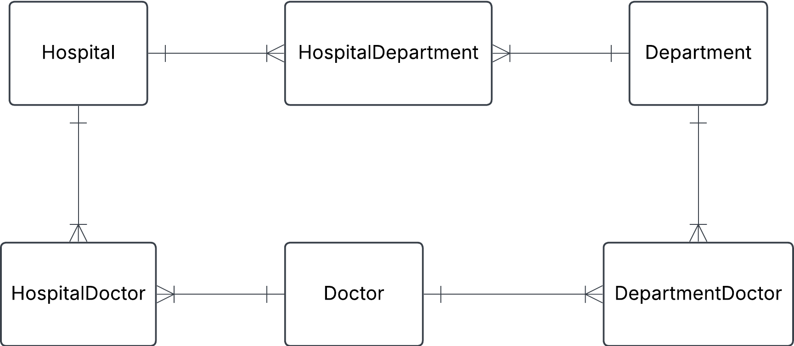

---
a) Create a logical data model using lucidcharts

b) Identify different keys on the various entities

c) Identify child entities and parent entities. What makes them into parent/child relationships?

d) Create a physical data model using dbdiagram

e) Create a few tables manually, insert given data plus some more, and try to manually link foreign keys to primary keys. Can you satisfy that a doctor can work at several departments and several hospitals?

# Solution

## a)

## b)

### Hospital

hospital_id PRIMARY KEY

name

address

### Department

department_id PRIMARY KEY

name

### Doctor

doctor_id PRIMARY KEY

name

### HospitalDepartment

hospital_id FOREIGN KEY

department_id FOREIGN KEY

### HospitalDoctor

hospital_id FOREIGN KEY

doctor_id FOREIGN KEY

### DepartmentDoctor

department_id FOREIGN KEY

doctor_id FOREIGN KEY

## c)

### Parent entity

Hospital Department

Department

Doctor

### Child entity

HospitalDepartment

HospitalDoctor

DepartmentDoctor

**To define parent/child relationship follow the rules:**

- Parent is an entity that is referenced by other entities.
- A child entity depends on or is associated with a parent.

## d)

---
**Hospital**

| hospital_id | name         | address          |
| ----------- | ------------ | ---------------- |
| 1           | Sjukhusstock | Drottninggatan 3 |
| 2           | Sjukhussoder | Sodergatan 3     |

---
**Department**

| department_id | name       |
| ------------- | ---------- |
| 1             | Kardiologi |
| 2             | Neurologi  |
| 3             | Gynekologi |

---
**Doctor**

| doctor_id | name                |
| --------- | ------------------- |
| 1         | Dr. Abra Abrahamson |
| 2         | Dr. Erika Eriksson  |
| 3         | Dr. Sven Svensson   |
| 4         | Dr. Carl Carlsson   |
| 5         | Dr. Anna Karlsson   |
| 6         | Dr. Sara Lindgren   |

---
**HospitalDepartment**

| hospital_id | department_id |
| ----------- | ------------- |
| 1           | 1             |
| 1           | 2             |
| 2           | 1             |
| 2           | 2             |
| 2           | 3             |

---
**HospitalDoctor**

| hospital_id | doctor_id |
| ----------- | --------- |
| 1           | 1         |
| 1           | 2         |
| 1           | 3         |
| 1           | 6         |
| 2           | 3         |
| 2           | 4         |
| 2           | 5         |
| 2           | 6         |

---
**DepartmentDoctor**

| department_id | doctor_id |
| ------------- | --------- |
| 1             | 1         |
| 1             | 6         |
| 2             | 2         |
| 2             | 3         |
| 2             | 4         |
| 3             | 5         |
| 3             | 6         |