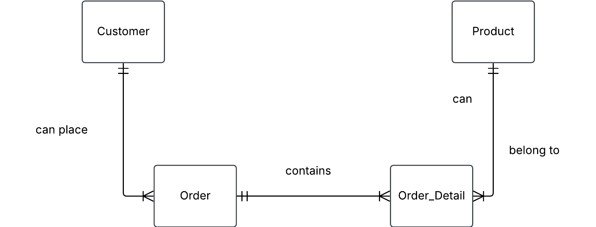

# 0. Ezecream orders

Our beloved ice cream company Ezecream has a Sales table that looks like this

| order_id | order_date | customer_id | customer_name  | customer_address | product_id | product_name | quantity |
| -------- | ---------- | ----------- | -------------- | ---------------- | ---------- | ------------ | -------- |
| 101      | 2024-04-05 | 05          | Ragnar Lodbrok | Kattegatt 3      | 3          | Blåbärsmagi  | 20       |
| 101      | 2024-04-05 | 05          | Ragnar Lodbrok | Kattegatt 3      | 5          | Lakritsdröm  | 15       |
| 101      | 2024-04-05 | 05          | Ragnar Lodbrok | Kattegatt 3      | 1          | Lichipichi   | 35       |
| 105      | 2025-01-10 | 15          | Feliz Fernadu  | Madridugatan 2   | 8          | Gitlass      | 30       |
| ...      | ...        | ...         | ...            | ...              | ...        | ...          | ...      |

a) Find different problems with this table, so that Ezecream will take you in for internship to fix it for them

b) Does this table satisfy 1NF, 2NF? Motivate.

b) Normalize this table to 3NF, make conceptual diagram and relational schema notation for each relation. Relational schema notation is `RelationName(attribute1, attribute2, ...)`

c) Now also add price attribute. Think about what would happen when price increases or decreases.

d) Write SQL code to get the total price for Ragnar Lodbrok. Insert data into your tables and test it out.

# Solution 
## a)

You will get redundancy data in customer_name if one customer wants more product, same with product_name.
It will create a problem if you wanna delete a product, the whole row will be deleted.

1) data redundancy 
Definition: same values repeated across multiple rows. 
Problems, inconsistency increase and storage usage.
Example: look order 101: name + address repeated 3 times.

2) deletion anomaly
 - definition: deletion of a record leads to unintentional loss of data. In other words you remove data you wanted to remove PLUS data that you should have kept.
 - Example: if we remove row with order 101, and there is no other order linked to product Blåbärsmagi, then we lose info about this product.

3) Insertion anomaly 
- definition: inserting data is not possible because values and attributes are missing (depends on the constraints on the DB).
- Example: adding a new customer without chosen product and/or quantity.

4) Update anomaly
- Definition: updating/modifying a value leads to inconsistencies with other rows. In other words one update would update same info in several places.
- Example: If we need update name/address of a customer that is present in several rows, we would have to manually update it in each row linked to this customer or create inconsistent data.

## b)

**checklist 1NF**
- row order doesn't matter      (exists)
- PK in each table              (exists)   only if we allow an implicit PK in form of a composite key (order_id, product_id).
                                           
    **Comment:** it is not possible for a customer to add to same order, product with a new quantity. 
- No repeating groups           (exists)   
- Uniform column data           (exists)   
Data type can't be mixed within a column, one attribute = one data type

**checklist 2NF**

- 1NF                            (exists) 
- Non prime attributes must 
  be functionally dependent on 
  entire primary key and not 
  just part of it.               (no)

**question** 

1) Which column/columns are your primary key?
2) Go through each column thats is NOT a part of PK?
3) Check if this column is functionally dependent on column/columns that make a pk?
4) If Yes on all --> 2NF

## c)

**Customer**
- customer_id (PK)
- customer_name
- address

**Order**
- order_id (PK)
- order_date
- customer_id (FK)

**Product**
- product_id (PK)
- product_name

**Order_Detail**
- Composite primary key (order_id, product_id) (PK)
- order_id (FK)
- product_id (FK)
- quantity

**conceptual ERD**

***Relational schema notation*** 

- Customer(customer_id, customer_name, customer_address)
- Product(product_id, product_id)
- Order(order_id, order_date, customer_id)

## d)

A: We add price as an attribute to product table. It works only if the price remains constant.

B: If price increase or decrease over time, solution A would not work, because historical orders would end up with wrong price. 

C: Alternative: Add price list entity that would keep track of historical prices.

D: Add price to Product and current_price to Order_Detail that fetches the current price for a product from Product.